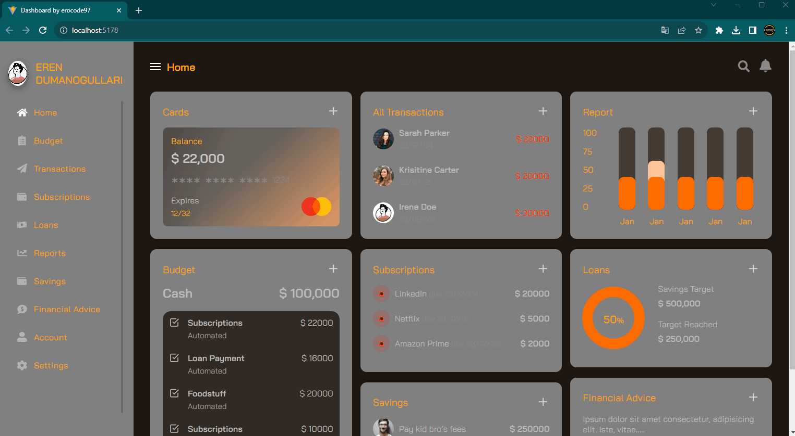

<h1>
 Personal Financial Management Dashboard
</h1>

I have developed a comprehensive personal finance management dashboard using React.js and Vite.js. This dashboard allows me to efficiently manage various aspects of my financial life. From budgeting and transaction tracking to managing subscriptions, monitoring credit, generating detailed financial reports, exploring investment opportunities, receiving tailored financial advice, accessing account details, and customizing settings – I have all the tools at my fingertips. With a user-friendly interface and robust data security, my dashboard offers a seamless solution to navigate and optimize my financial journey on my own terms.

<h1>Used Technologies </h1>
<ul>

<h1>
 Preview 🎥
</h1>

